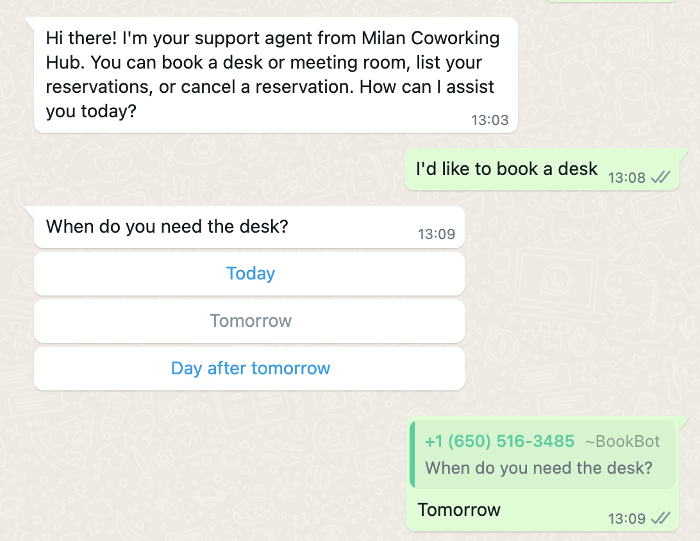
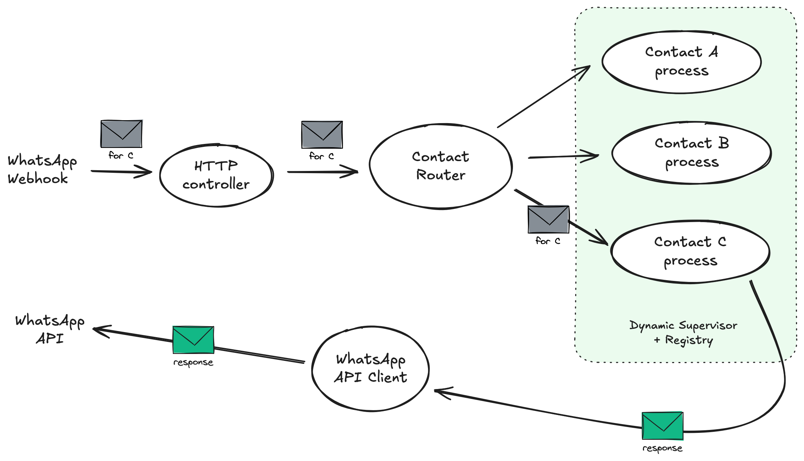
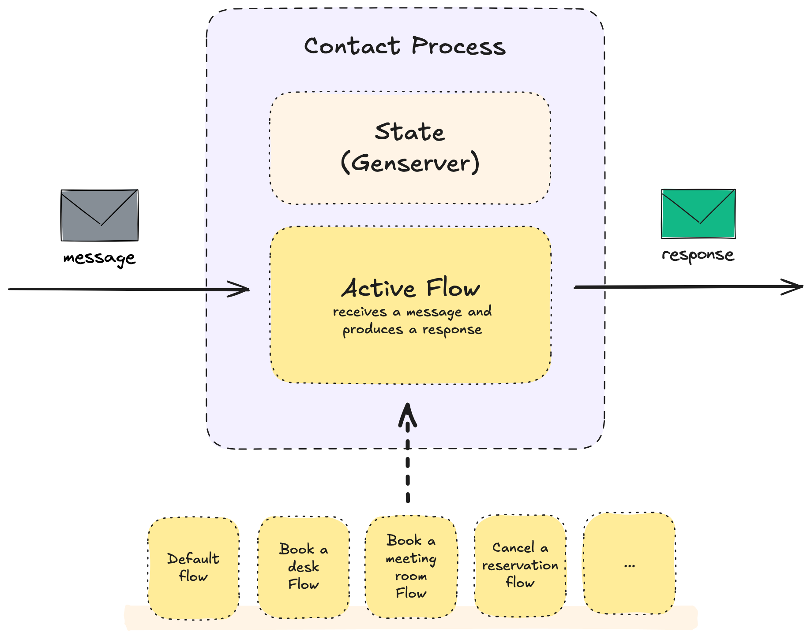

# Wafer

An example Phoenix project showcasing how to use WhatsApp as a frontend for your Phoenix backend using the WhatsApp Business Platform.

## What we are building

Let's create a WhatsApp app for a co-working space that allows users to:

- Book a desk
- Book a meeting room
- View their bookings
- Cancel a booking



## Implementation details

- There's a controller that receives WhatsApp messages from Meta's webhook.
- We start a GenServer for each WhatsApp contact who is messaging us, storing chat messages in the state.
- We are not interested in storing messages, as chat sessions are short-lived and ephemeral (e.g., booking a desk).
- We have a GPT-based AI agent that answers users' basic questions and handles predefined flows (e.g., a flow for booking a desk).
- When the agent recognizes predefined intents (e.g., “book a desk”), it triggers the corresponding flow.

### Architecture



### Contact Process



## Phoenix instructions

To start your Phoenix server:

- Run `mix setup` to install and setup dependencies
- Start Phoenix endpoint with `mix phx.server` or inside IEx with `iex -S mix phx.server`

Now you can visit [`localhost:4000`](http://localhost:4000) from your browser.

Ready to run in production? Please [check our deployment guides](https://hexdocs.pm/phoenix/deployment.html).

To start Observer you can run:

```sh
iex -S mix phx.server
Mix.ensure_application!(:observer)
:observer.start()
```
